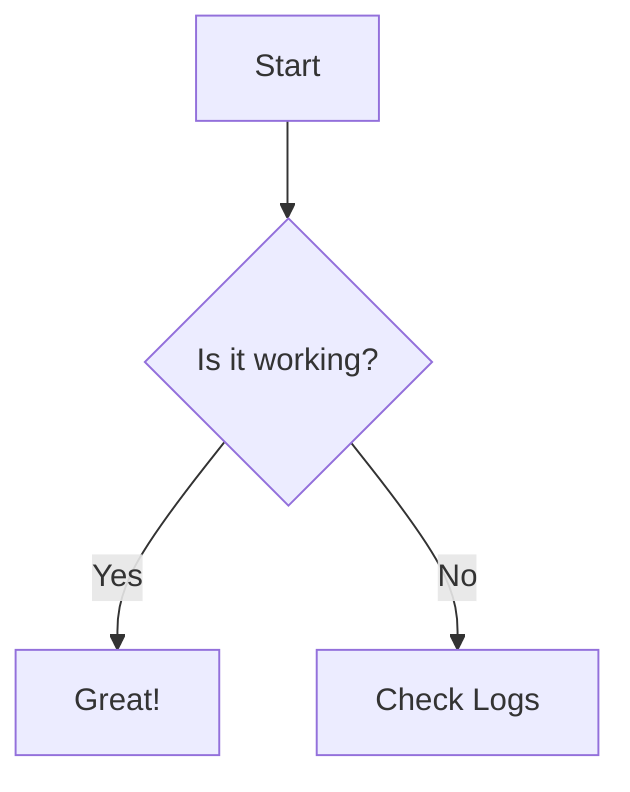

[](https://github.com/pasunboneleve/markdown-mermaid/actions/workflows/test.yml)
[](https://github.com/pasunboneleve/markdown-mermaid/actions/workflows/melpazoid.yml)

# markdown-mermaid.el

Run Mermaid diagrams from Markdown inside Emacs using the `mmdc` CLI.

Place your cursor inside a ```mermaid``` block, trigger a command, and
get an instant preview — no wrappers, no servers, no reimplementation.

This package shells out to the official Mermaid CLI (`mmdc`) to render
diagrams, then displays the result in a separate Emacs buffer.

It also automatically adapts diagram colors to your current Emacs
theme.

## Why

Most Mermaid integrations either embed a renderer or add unnecessary
layers.  This package stays minimal: use the existing CLI, integrate
it tightly into your editing workflow, and keep the feedback loop
fast.

## Prerequisites

This package requires the Mermaid Command Line Interface. You must
have Node.js installed.

```bash
npm install -g @mermaid-js/mermaid-cli
```

Verify the installation by running:

```bash
mmdc --version
```

## Installation

### Using `package-install` (MELPA)

```elisp
(package-install 'markdown-mermaid)
```

### Using [elpaca](https://github.com/progfolio/elpaca/blob/master/doc/manual.org#use-package-integration) (recommended)

```elisp
(use-package markdown-mermaid
  :ensure (markdown-mermaid :type git :host github :repo "pasunboneleve/markdown-mermaid")
  :bind (:map markdown-mode-map
              ("C-c m" . markdown-mermaid-preview)))
```

### Using Emacs 29+ (`package-vc`)

```elisp
(use-package markdown-mermaid
  :vc (:url "https://github.com/pasunboneleve/markdown-mermaid" :rev :newest)
  :bind (:map markdown-mode-map
              ("C-c m" . markdown-mermaid-preview)))
```

### Using older Emacs (< 29)

1. Clone this repository:

```bash
git clone https://github.com/pasunboneleve/markdown-mermaid.git ~/.emacs.d/site-lisp/markdown-mermaid
```

2. Add to your `init.el`:

```elisp
(add-to-list 'load-path "~/.emacs.d/site-lisp/markdown-mermaid")
(require 'markdown-mermaid)
```

## Usage

Think of this as: **run `mmdc` at point**.

1. Open a Markdown file (`.md`).

2. Create a Mermaid code block:



3. Place your cursor anywhere inside the code block.

4. Run:

* `M-x markdown-mermaid-preview`
* or your keybinding (e.g. `C-c m`)

A new buffer opens with the rendered diagram.

## Configuration

Customize via:

```
M-x customize-group RET markdown-mermaid
```

### Variables

| Variable | Default | Description |
| :---------------------------- | :------------------------- | :------------------------------------------------------------------------ |
| `markdown-mermaid-mmdc-path` | `(executable-find "mmdc")` | Path to the Mermaid CLI executable. Set manually if Emacs cannot find it. |
| `markdown-mermaid-temp-files` | `nil` | Internal: tracks temporary files for cleanup.  |

## Theming

The diagram automatically adapts to your current Emacs theme:

* **Background** → `default` background
* **Text** → `default` foreground
* **Borders** → `font-lock-type-face`
* **Lines / arrows** → `font-lock-constant-face`

## Troubleshooting

### Mermaid CLI not found

* Ensure you installed it:

```bash
npm install -g @mermaid-js/mermaid-cli
```

* If using `nvm`, Emacs may not inherit your PATH. Set it manually:

```elisp
(setq markdown-mermaid-mmdc-path "/home/user/.nvm/versions/node/v14/bin/mmdc")
```

### Compilation failed

Check the `*mermaid-error*` buffer for CLI output and syntax errors.

## Development

Run tests locally:

```bash
make test
```
